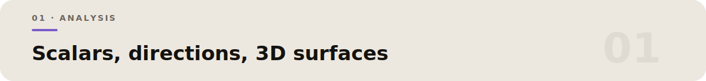
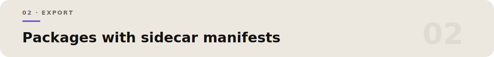

<p align="center">
  
</p>

# AnisoScope

**Directional elastic properties from a 6×6 stiffness matrix — with provenance.**

Python desktop tool for crystal elastic anisotropy from Voigt `Cij`. Traceability first: input matrix, unit, crystal system, sampling, plot style, and export settings travel with every result.

<p align="center">
  
</p>

- Full `6×6` Voigt matrix (GPa) · system templates cubic → triclinic  
- Stability: symmetry, invertibility, condition, positive definite, Born where available  
- Compliance `Sij` · VRH scalars · `A_U` · directional `E(n)`, `β(n)`, mean `G`, `ν`  
- 1D / 2D polar / 3D surfaces · GIF · MP4 when `ffmpeg` exists  

### Install & launch

```powershell
git clone https://github.com/D-sudoasd/anisoscope.git
cd anisoscope
py -3.11 -m pip install -r requirements.txt
py -3.11 -m anisoscope
# or: anisoscope · start_anisoscope.bat
```

Workflow: system → matrix → **Analyze + Update Figures** → Dashboard / Results / 1D–3D → export.

Voigt order `[11,22,33,23,13,12]` with engineering shear convention (avoids factor-of-two shear mistakes).

Examples: Al / Si / MgO cubic · `examples/*.json`

<p align="center">
  
</p>

`Export Full Package` → `manifest.json`, stiffness/compliance CSVs, polycrystalline summaries, surface samples, etc. Single figures write `<file>.manifest.json`.

3D: PyVista/VTK surface + Matplotlib labels; sequential palettes for modulus.

```powershell
py -3.11 -m pytest -q
```

Limits: cannot certify user Cij; 3D shear/Poisson use transverse means by default; high sampling is slow.

See repository license / source notices for redistribution.
