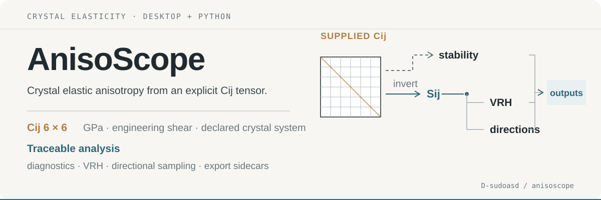
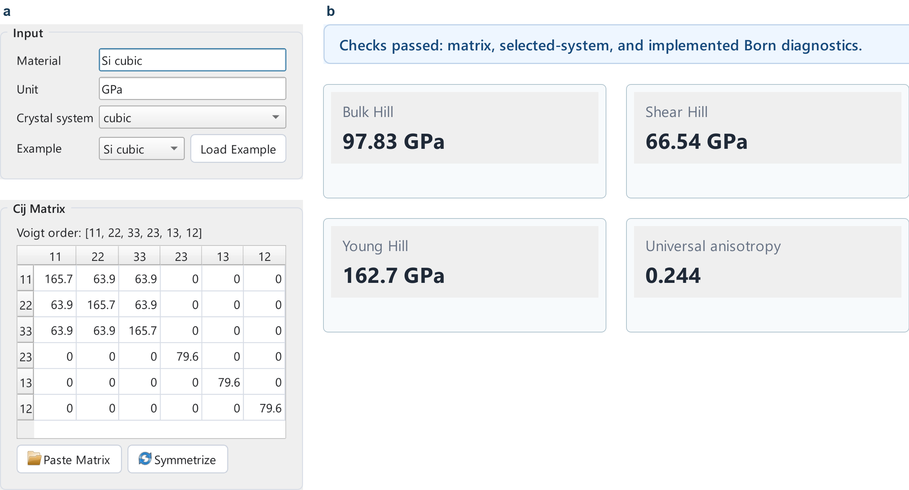

# AnisoScope

**Directional elastic properties from a 6 × 6 stiffness matrix, with traceable exports.**

[](https://github.com/D-sudoasd/anisoscope/actions/workflows/tests.yml)
[](https://www.python.org/)
[](LICENSE)
[](CITATION.cff)

<p align="center">
  
</p>

AnisoScope is a Python desktop application and numerical toolkit for inspecting
crystal elastic anisotropy from a stiffness matrix, $C_{ij}$. It is intended for
materials researchers who need to move from a reported or calculated elastic
tensor to stability checks, scalar averages, directional properties, figures,
and reusable tabular data without losing the input convention and sampling
settings that produced each result.

The software does not determine whether a tensor is physically appropriate for
a specimen or calculation. Instead, it makes the numerical workflow inspectable:
the matrix, unit, crystal system, Voigt convention, and sampling grid are
written alongside generated results; visual settings are added where applicable
to figure and animation sidecars.

<p align="center">
  
</p>

<p align="center"><em>Real application state: explicit Cij input and convention on the left; implemented diagnostics and Hill averages on the right. The bundled Si values are demonstration data, not reference constants.</em></p>

## Install and run

AnisoScope supports Python 3.11, 3.12, and 3.13. From a clone:

```bash
python -m pip install -e .
python -m anisoscope
```

Run these commands in an already activated environment. On Windows,
`start_anisoscope.bat` is also available; the installed console command is
`anisoscope`. See the [detailed installation](#detailed-installation-and-launch)
or [user guide](docs/USER_GUIDE.md) for environment creation, activation, and
the complete GUI workflow.

## Main capabilities

- Accept a full `6 × 6` Voigt stiffness matrix in GPa through the GUI or Python API.
- Apply templates for cubic, hexagonal, tetragonal, orthorhombic, trigonal
  (`rhombohedral` alias), monoclinic, and triclinic crystal systems.
- Check symmetry, selected crystal-system matrix relations, invertibility,
  conditioning, positive definiteness, and applicable implemented Born
  inequalities.
- Compute the compliance matrix, Voigt/Reuss/Hill polycrystalline estimates,
  the universal anisotropy index, and cubic Zener and Cauchy quantities.
- Sample directional Young's modulus and linear compressibility, plus
  transverse-mean shear modulus and Poisson ratio.
- Create direction-path, polar, and three-dimensional surface plots and export
  static figures, GIF animations, or MP4 files when `ffmpeg` is available.
- Export CSV/XLSX/JSON result packages and sidecar manifests containing the
  analysis inputs and sampling parameters.

## Detailed installation and launch

A virtual environment is recommended.

```powershell
git clone https://github.com/D-sudoasd/anisoscope.git
cd anisoscope
python --version
python -m venv .venv
.\.venv\Scripts\Activate.ps1
python -m pip install --upgrade pip
python -m pip install -e .
```

On macOS or Linux, create and activate the environment with:

```bash
python3 -m venv .venv
source .venv/bin/activate
python -m pip install --upgrade pip
python -m pip install -e .
```

For development and testing, install the optional test dependencies:

```powershell
python -m pip install -e ".[test]"
```

After installation, either command launches the application:

```powershell
python -m anisoscope
anisoscope
```

Windows users can also run:

```powershell
.\start_anisoscope.bat
```

The legacy entry points `python -m crystal_elastic_workbench` and
`crystal-elastic-workbench` remain available for compatibility.

## GUI Workflow

1. Choose the crystal system and enter a material label.
2. Enter, paste, import, or load a demonstration `6 × 6` matrix.
3. Select **Analyze + Update Figures**.
4. Inspect the stability diagnostics and scalar values on the Dashboard and
   Results tabs, then inspect the 1D, 2D, and 3D directional views.
5. Export a selected figure/data set or choose **Export Full Package** to write
   the analysis tables and provenance manifest together.

Editing one off-diagonal cell mirrors the edit across the matrix diagonal.
Importing a complete matrix preserves its original asymmetry so that the
analysis can report it rather than silently correcting it.

## Minimal Python example

The executable example in [`examples/minimal_analysis.py`](examples/minimal_analysis.py)
uses an exactly isotropic synthetic tensor, performs stability and elastic
property checks, samples a plane, and writes a traceable result package:

```powershell
python examples\minimal_analysis.py --output outputs\minimal-example
```

Core library use is also direct:

```python
from crystal_elastic_workbench import ElasticTensor, check_stability

tensor = ElasticTensor(
    [[220, 100, 100, 0, 0, 0],
     [100, 220, 100, 0, 0, 0],
     [100, 100, 220, 0, 0, 0],
     [0, 0, 0, 60, 0, 0],
     [0, 0, 0, 0, 60, 0],
     [0, 0, 0, 0, 0, 60]],
    crystal_system="cubic",
    material_name="Synthetic isotropic example",
)

stability = check_stability(tensor.stiffness_matrix, crystal_system="cubic")
summary = tensor.polycrystalline_summary()
print(stability.overall_stable, summary.young_hill_gpa)
```

The bundled Al, Si, and MgO matrices are demonstrations and regression inputs,
not reference data. Verify source convention, temperature, pressure, and units
before using any elastic constants in research.

## Cij Input Convention

The fixed Voigt order is:

```text
[11, 22, 33, 23, 13, 12]
```

The stiffness and compliance matrices use engineering shear strain:

```text
[e11, e22, e33, 2e23, 2e13, 2e12]
    = S [s11, s22, s33, s23, s13, s12]
```

Directional shear calculations apply a physical stress tensor and convert the
resulting engineering-strain vector back to a symmetric strain tensor. The
conversion is covered by analytical regression tests.

## Exported Files

**Export Full Package** writes the input and derived data together:

- `manifest.json`
- `stiffness_matrix.csv` and `compliance_matrix.csv`
- `polycrystalline_summary.csv`
- `elastic_model_summary.csv` and `elastic_model_summary.xlsx`
- `elastic_model_notes.json` and `stability.json`
- plane samples for Young's modulus and compressibility
- surface samples for Young's modulus, compressibility, shear modulus, and
  Poisson ratio

Single-figure, animation, sampled-data, and model-table exports write a sidecar
named `<output>.manifest.json`. The sidecar records the input matrix, unit,
crystal system, program version, export type, plotting choices, and sampling
grid. For shear and Poisson-ratio sampling, it also records the transverse
aggregation and sample count; figure and animation sidecars include the
relevant rendering settings.

## 3D Rendering and Palettes

The preferred three-dimensional path uses PyVista/VTK for the surface and
Matplotlib for high-resolution composition. If PyVista rendering is unavailable,
figure export can use a Matplotlib fallback. Sequential palettes should be used
for non-negative moduli or magnitudes; diverging palettes are appropriate only
for quantities with a meaningful center or sign change.

## Documentation

- [`docs/USER_GUIDE.md`](docs/USER_GUIDE.md): input, analysis, interpretation,
  export, and troubleshooting workflow.
- [`docs/API.md`](docs/API.md): supported public Python API with examples.
- [`paper/paper.md`](paper/paper.md): JOSS manuscript source and software-paper
  scope.
- [`CONTRIBUTING.md`](CONTRIBUTING.md): development setup, tests, and pull-request
  expectations.
- [`CODE_OF_CONDUCT.md`](CODE_OF_CONDUCT.md): community participation rules.
- [`CHANGELOG.md`](CHANGELOG.md): candidate-version changes and release history.

## Testing

Run the full suite from the repository root:

```powershell
python -m pytest -q
```

The tests cover analytical isotropic limits, engineering-shear conversion,
stability checks, crystal templates, sampling, manifest contents, static and
animated exports, GUI smoke behavior, and packaging/documentation consistency.
The repository includes a continuous-integration workflow configured to run the
test suite and build distribution artifacts on Windows and Linux.

## Known Limits

- AnisoScope cannot certify that user-supplied elastic constants, units, axes,
  or thermodynamic conditions are correct.
- Trigonal and monoclinic tensors occur under multiple axis and sign
  conventions; users must match the convention of the source data.
- The high-symmetry matrix-relation diagnostics use the conventions implemented
  by the input templates. Monoclinic and triclinic inputs rely on symmetry,
  invertibility, and positive definiteness; their source convention is not
  validated and no compact system-specific Born shortcut is applied.
- Three-dimensional shear and Poisson surfaces use the mean over sampled
  transverse directions by default, not the strict transverse extrema.
- Dense shear and Poisson surface grids are comparatively slow because every
  direction requires a transverse scan.
- MP4 export requires a working local `ffmpeg`; GIF export does not.

## Contributing and support

Bug reports and feature requests are welcome through the repository issue
tracker. Please include a minimal input matrix, expected behavior, actual
behavior, platform, Python version, and the exported manifest where applicable.
See [`CONTRIBUTING.md`](CONTRIBUTING.md) before proposing code changes and
[`SECURITY.md`](SECURITY.md) for security-sensitive reports.

## Citation

**Development status:** `0.1.0` release candidate. No Git tag, GitHub Release,
archived software DOI, or JOSS acceptance is claimed yet.

Citation metadata is available in [`CITATION.cff`](CITATION.cff). Until a
versioned archive DOI exists, cite the exact AnisoScope release or commit used
and include the repository URL. Do not substitute a future or placeholder DOI.

## License

AnisoScope is distributed under the [MIT License](LICENSE). Copyright 2026
Delun Gong.
